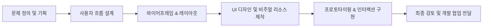
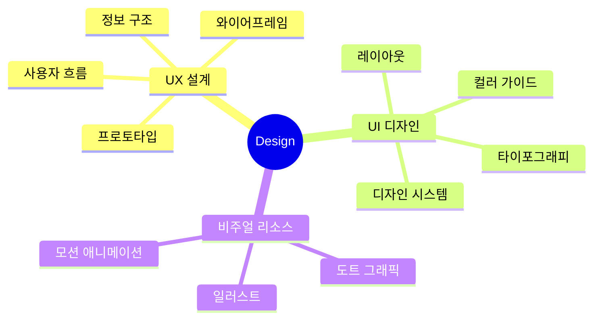

# UI/UX · 웹디자이너

사용자의 흐름을 고려하여 직관적이고 아름다운 **화면 경험**을 설계합니다.
편집 디자인과 비주얼 일러스트를 기반으로 서비스의 다채로운 매력을 시각화합니다.

`UI/UX 디자인` / `웹디자인` / `랜딩페이지` / `상세페이지` / `편집디자인` / `일러스트`

---

## 📋 소개

| 구분 | 내용 |
|---|---|
| 디자인 분야 | UI/UX 디자인, 웹디자인, 편집 디자인, 상세·랜딩페이지 |
| 비주얼 역량 | 일러스트 제작, 가독성 높은 레이아웃 설계, 브랜드 비주얼 기획 |
| 개발 협업 | HTML/CSS 마크업 구조 이해 (개발자와의 원활한 소통 가능) |
| 관심 분야 | 디자인 시스템 구축, 웹 접근성 지침을 고려한 UI 설계 |

## 🎯 주요 관심 영역

| 영역 | 설명 |
|---|---|
| 비주얼 스토리텔링 | 브랜드의 메시지를 매력적인 일러스트와 그래픽으로 시각화합니다. |
| 목적 기반 디자인 | 구매 전환을 높이는 상세페이지와 사용자를 사로잡는 랜딩페이지를 연구합니다. |
| 일관성 있는 UI | 서비스의 매력을 통일감 있게 전달하는 디자인 시스템과 컴포넌트에 관심이 많습니다. |
| 친절한 사용자 경험 | 사용자가 화면 안에서 길을 잃지 않도록 쉽고 직관적인 흐름을 설계합니다. |

---

## 🛠️ 사용 도구와 기술

`Figma` `Photoshop` `Illustrator` `After Effects` `Premiere Pro` `Aseprite` `Spine` `Clip Studio Paint` `HTML5` `CSS3` `Git` `GitHub`

## 📂 포트폴리오 프로젝트

| 프로젝트 유형 | 주요 작업 영역 | 사용 툴 |
|---|---|---|
| **UI/UX 디자인** | 사용자 흐름(User Flow), 와이어프레임, 프로토타입 설계, 디자인 시스템 구축 | Figma, Photoshop |
| **웹 · 랜딩페이지 디자인** | 메인/서브 페이지 레이아웃, 컬러 & 타이포그래피 가이드, 가독성 중심의 비주얼 리소스 기획 | Figma, Illustrator, Photoshop |
| **비주얼 UI & 웹 구현** | 고품질 그래픽 및 모션 소스 제작, 포토샵 비주얼 보정, HTML/CSS 기반 웹 화면 구현 검토 | Photoshop, Illustrator, After Effects, HTML/CSS |

---

## ⚙️ 작업 프로세스

---

## 🧠 디자인 사고 구조

---

## 📚 학습 및 연구 분야

* **UI/UX & Web**
  * 디자인 시스템 및 UI 컴포넌트 설계 고도화
  * 개발자 소통을 위한 웹 구조(HTML/CSS) 이해
* **Visual & Motion**
  * 2D 애니메이션(Spine) 및 인터랙티브 모션 연구
* **3D Graphic** `학습 중`
  * Blender를 활용한 3D 그래픽 소스 제작 및 모델링
* **Illustration** `이수 / 연구 중`
  * 클립스튜디오 기반 만화 연출 및 드로잉 고도화

## Contact

| 구분 | 링크 |
|---|---|
| Email | sormadbwls@naver.com |
| Portfolio | 준비 중 |
| GitHub | https://github.com/sormadbwls-ux |
