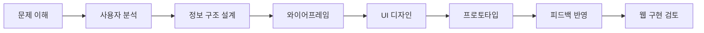
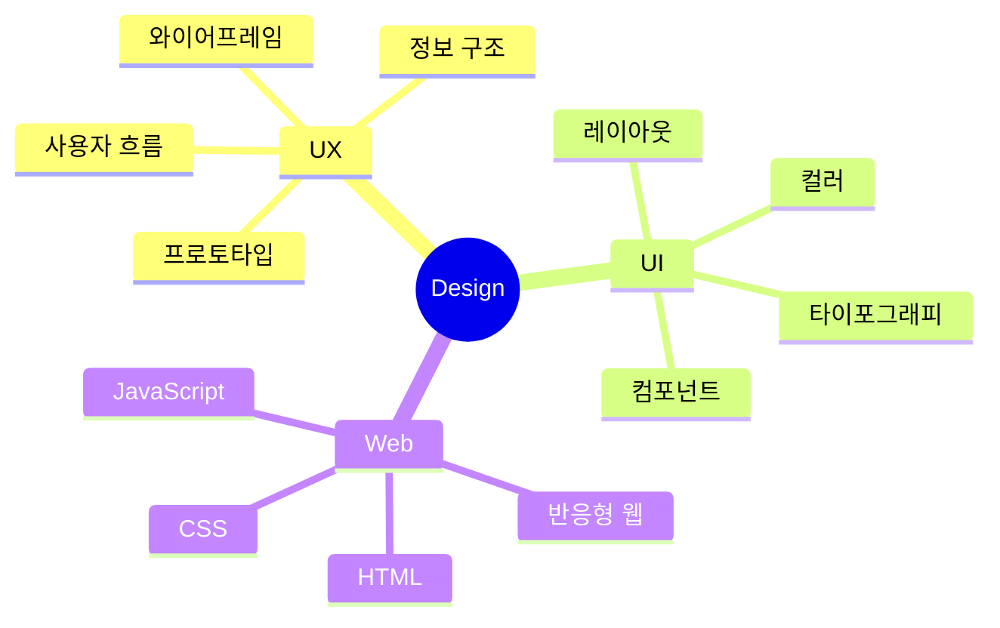

# UI/UX · 웹디자이너

사용자의 흐름을 이해하고,  
**디자인에서 웹 구현까지 연결되는 화면 경험**을 설계합니다.

`UI/UX 디자인` · `웹디자인` · `Figma` · `반응형 웹` · `HTML` · `CSS` · `JavaScript`

---

## 소개

| 구분 | 내용 |
|---|---|
| 디자인 분야 | UI/UX 디자인, 웹디자인, 비주얼 디자인 |
| UX 설계 | 사용자 흐름, 정보 구조, 와이어프레임, 프로토타입 |
| 웹 이해도 | HTML, CSS, JavaScript, 반응형 웹 |
| 관심 분야 | 디자인 시스템, 웹접근성, 퍼블리싱, 사용자 경험 개선 |

---

## 주요 관심 영역

| 영역 | 설명 |
|---|---|
| UI/UX 디자인 | 사용자가 이해하기 쉬운 화면 흐름과 구조를 설계합니다. |
| 웹디자인 | 브랜드와 서비스 목적에 맞는 웹 인터페이스를 디자인합니다. |
| 퍼블리싱 이해 | 디자인이 실제 웹 화면에서 구현되는 방식을 고려합니다. |
| 디자인 시스템 | 색상, 타이포그래피, 버튼, 컴포넌트를 일관성 있게 정리합니다. |

---

## 사용 도구와 기술

### Design

### Web

### Tools

---

## 포트폴리오 프로젝트

| 프로젝트 | 유형 | 주요 작업 |
|---|---|---|
| UI/UX 디자인 프로젝트 | UX/UI | 사용자 흐름, 정보 구조, 와이어프레임, 프로토타입 |
| 웹디자인 프로젝트 | Web Design | 메인 페이지, 서브 페이지, 컬러 시스템, 타이포그래피 |
| 퍼블리싱 프로젝트 | Frontend | HTML, CSS, JavaScript, 반응형 웹 구현 |

---

## 작업 프로세스

---

## 디자인 사고 구조

---

## 현재 학습 중인 내용

---

## Contact

| 구분 | 링크 |
|---|---|
| Email | your-email@example.com |
| Portfolio | 준비 중 |
| GitHub | https://github.com/your-github-id |
